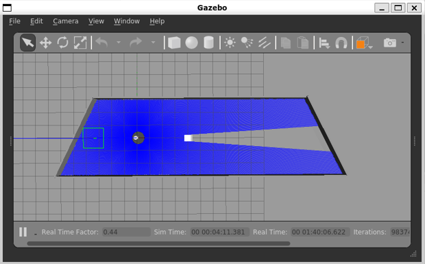
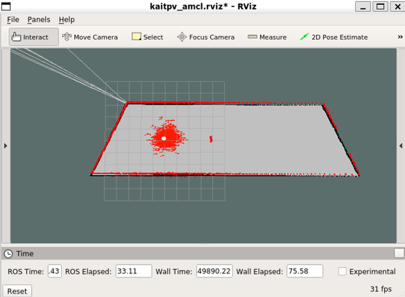

# KaitPV
ロボットテスト用GazeboシミュレータとMATLAB経路生成
* 障害物は静止と移動(歩行者想定)
    * 位置、速度など設定可能
* 先進研風の実験室（寸法などは適当）
* amclでの自己位置推定
* MATLABのサンプル経路生成プログラム
* ロボットはメガローバシミュレータ使用


移動障害物実験
<div><video controls src="https://user-images.githubusercontent.com/47593183/210132659-54314fad-dedf-4234-b3df-dabe08eec6b0.mp4" muted="false"></video></div>
<div><video controls src="images/kaitpv_gazebo_walk1.mp4" muted="false"></video></div>

静止障害物実験


自己位置推定



# 動作条件

* ubuntu 18.04
* ros melodic
* megarover シミュレータ
    * インストールはcd ~/catkin_ws/src; git clone https://github.com/vstoneofficial/megarover_samples/
* WSL2 (windows11)でも動作確認済

# インストール
git cloneだけで動くと思われるが、念のため一部再buildする

```bash
cd ~/catkin_ws/src
git clone https://github.com/kait-wakita/kaitpv.git
cd plugins/animatedbox
rm -rf build
mkdir build
cd build
cmake ..
make
```

# 使用方法(Gazebo)

静止物シミュレーション
```bash
roslaunch kaitpv kaitpv_with_d2_stay1.launch
```

移動物シミュレーション (source gazebo_path_set.shは一度実行すれば良い)
```bash
roscd kaitpv/plugins/animatedbox
source gazebo_path_set.sh
roslaunch kaitpv kaitpv_with_d2_walk1.launch
```

# 使用方法(MATLAB)
* init_ROS.m: ROSとの通信設定、wslのipアドレスは毎回変わるので設定
* keycntl.m: キーコマンドでロボットを操作
* simple_navi.m: 出発地と目的地の移動、静止障害物は回避可能

#  カスタマイズ方法
* 移動物の位置・速度
    * kaitpv/plugin/animatedbox/animatedbox.cc
        * Translation(ignition::math::Vector3d(10, 0, 0))などを適切に修正
        * 編集後、animatedbox/buildで再度make
* ロボットの初期位置
    * kaitpv/robot/vmegarover.urd.xacro
        * base_footprintの記述で指定(??)
        * \<origin xyz="0 0 0"/>
* Lidarのスペック
    * kaitpv/robot/vmegarover.urd.xacro
        * LRFの記述で指定
        * \<xacro:lrf_gazebo_v0 prefix="front" min_rad="-3.14" max_rad="3.14" min_range="0.5" max_range="100.0"/>


# 注意点
* WSL2では、Gazeboでのシミュレーションが立ち上がらくなる事あり、原因・対策不明、何度か繰り返すと解決する場合あり、最終的には再起動

# Note
* 2022.12.31 最初のバージョン

# Author

* wakit@cco.kanagawa-it.ac.jp

# License

"kaitpv" is under [MIT license](https://en.wikipedia.org/wiki/MIT_License).
